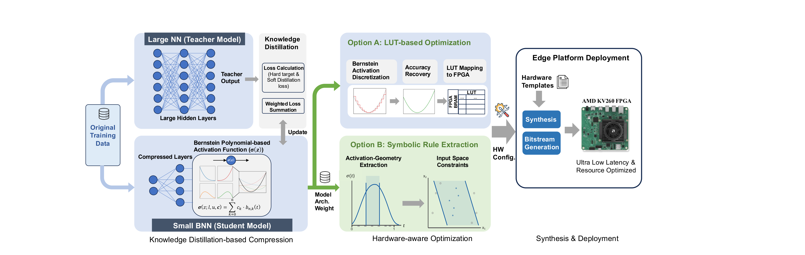
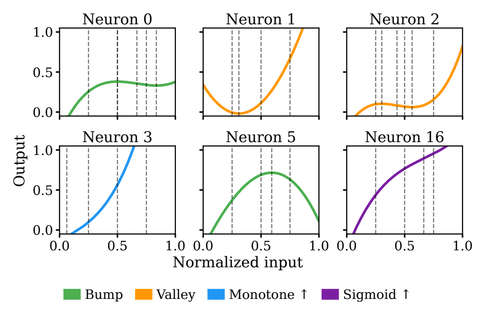
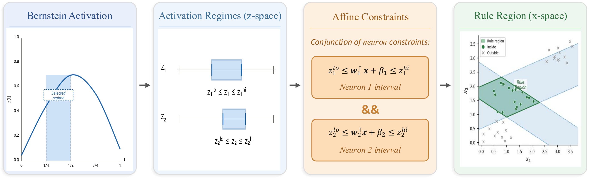
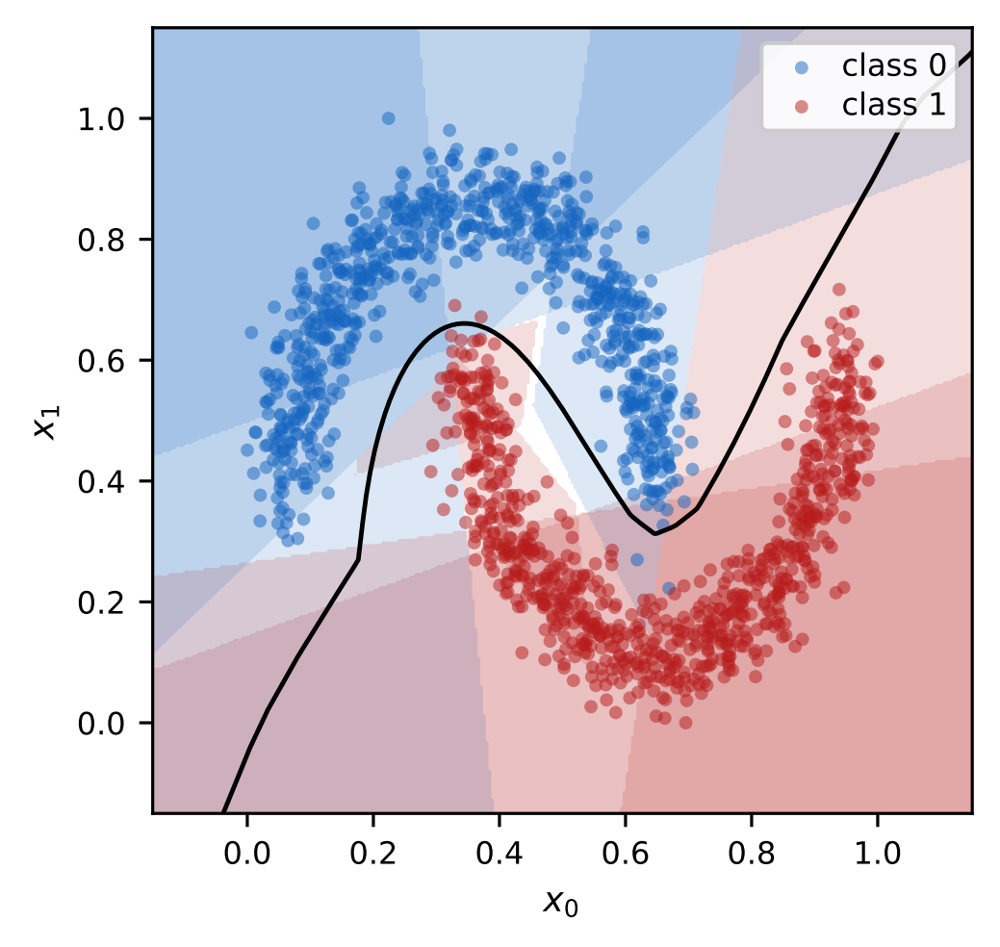

# Bern2Edge

Knowledge-distillation of Bernstein-activation student networks and their
extraction into interpretable, hardware-friendly symbolic rules, on the Adult,
Cover Type, HIGGS, MAGIC, and ACS Income datasets.

> **Artifact evaluation.** See [INSTALL.md](INSTALL.md) (install + smoke test),
> [REQUIREMENTS.md](REQUIREMENTS.md), [STATUS.md](STATUS.md) (badges), and
> [LICENSE](LICENSE). The accepted paper is included as
> [Bern2Edge.pdf](Bern2Edge.pdf).

## Start here

All commands in this README are run from the repository root. For a first
evaluation:

```bash
python -m venv .venv
source .venv/bin/activate
pip install -e .
python Adult/make_table3.py
python MAGIC/make_table5.py
python MAGIC/make_table_x.py
python ACS/make_table_xi.py
python Transformer/make_table_xii.py
```

The five `make_table*.py` commands are network-free and take seconds. They
confirm that the environment works and render the committed results for Tables
III, V, X, XI, and XII. They do not retrain models or rerun FPGA synthesis.

The rest of this README follows the order of the included paper results.
[RESULTS.md](RESULTS.md) is the authoritative
coverage matrix: it says which values are recomputed from checkpoints, which
hardware measurements are shipped, and which paper results are not yet included.

The repository separates reusable code from experiments:

1. **`bern2edge/`** — the importable Python package containing shared models,
   data loaders, training utilities, Bernstein activations, and rule extraction.
2. **Experiment directories** — training drivers, checkpoints, and paper
   results. Table I aggregation is in `table_i_compression/`; student training
   remains in `Adult/`, `cover_type/`, and `higgs_small/`.

### Pipeline overview

A summary of the complete teacher-to-edge workflow.

[](figures/fig1.pdf)

*Overview of Bern2Edge: A high-accuracy teacher model is distilled into a
compressed BNN student via KD. The resulting representation is synthesized and
deployed via either exact LUT-based realization or symbolic rule extraction.*

## Install

```bash
pip install -e .                  # installs the deps and puts bern2edge on the path
```

Or `pip install -r requirements.txt` — the drivers add the repo root to `sys.path`
themselves, so `bern2edge` imports work without installing, as long as you run the
commands below from the repository root. See [INSTALL.md](INSTALL.md).

The Adult loader fetches the dataset from OpenML on first use (needs network
access); the fixed train/dev/test split is read from `Adult/adult_teacher_ordinal.pt`.

## IV-B. Student compression and synthesis (Tables I–II)

### Table I — compression and KV260 synthesis

The root reproducer rebuilds all 18 Table I rows for Adult, Covertype, and
HIGGS-Small. It evaluates the 90 shipped student checkpoints (18 models × five
folds), recomputes accuracy and cross-entropy from the weights, verifies each
accuracy against its checkpoint metadata, and joins the results to the paper's
KV260 synthesis measurements:

```bash
python table_i_compression/reproduce_table_i.py
python table_i_compression/reproduce_table_i.py --device cpu
```

It writes:

- `table_i_compression/table_i_checkpoint_results.csv` — per-fold checkpoint path, live accuracy,
  train CE, test CE, and the stored-vs-live accuracy check;
- `table_i_compression/table_i_results.csv` — the complete 18-row Table I result, including
  five-fold means/standard deviations and Bernstein-minus-ReLU deltas;
- `table_i_compression/table_i_hls_results.csv` — committed HLS latency, DSP, BRAM, and LUT values
  copied from Table I of the paper.

The paper's `CE Loss` convention is the mean training-set hard-label CE, so that
is `ce_loss_mean` in the final table; live held-out CE is retained as
`test_ce_mean` for auditability. The weights are authoritative: small differences
between a regenerated value and the rounded PDF are kept rather than replaced
with paper values. Dataset downloads are cached after the first run.

### Table II — Covertype under matched hardware budgets

`cover_type/` reproduces the Bernstein-vs-ReLU accuracy comparison under five
matched latency and BRAM budgets. The artifact ships the exact 50 student
checkpoints used by the table: ten model configurations × five folds
(`seed=1000` through `seed=1004`).

```bash
# Re-evaluate all 50 checkpoints and regenerate the accuracy/HLS table:
python cover_type/reproduce_table_ii.py
```

The first run downloads scikit-learn's Covertype dataset. The script reconstructs
the fixed stratified split (`seed=42`) and per-fold preprocessing, evaluates each
checkpoint on its original held-out test fold, verifies all ten five-fold means,
and writes:

- `cover_type/table_ii_checkpoint_results.csv` — every fold accuracy and its
  project-relative `.pth` path;
- `cover_type/table_ii_results.csv` — the five paper rows with full-precision
  accuracies, deltas, HLS latency/BRAM metrics, and checkpoint provenance.

The raw synthesis export is committed as
`cover_type/covertype_hls_results.csv`. HLS metrics are extracted from this CSV
and matched by complete architecture, activation, and Bernstein degree; the
artifact does not rerun FPGA synthesis. A successful run ends with
`Verified 50 checkpoints and all 10 five-fold means.` See
[cover_type/README.md](cover_type/README.md) for the exact model mapping,
acceptance tolerances, and the documented fourth-row standard-deviation display
difference in the paper.

## IV-C. Symbolic extraction (Tables III and V)

### Rule-extraction overview

An overview of the activation regimes, rule formation, and resulting rule
regions.

[](figures/fig4.pdf)

*Bernstein activation curves with analytically derived regime breakpoints. Six
representative neuron activations from a BNN (h = 64) trained on Adult, with
breakpoints from derivative roots and inflection points marked.*

[](figures/fig5.pdf)

*Activation-geometry-based rule formation. A selected regime in normalized
activation space (t) maps through z-space to an affine constraint in input
space, forming interpretable oblique regions.*

[](figures/fig6.pdf)

*Activation-geometry rule regions on the Two Moons dataset. Rules align with
the curved decision boundary via Bernstein-derived breakpoints, enabling compact
partitioning.*

### Table III — Adult rule extraction

```bash
# Reproduce the rule-extraction table (5 architectures x same-cov penalties):
python Adult/run_rule_extraction.py            # -> Adult/rule_results.csv, Adult/rule_jsons/
python Adult/make_table3.py                    # render the table (Markdown + LaTeX)

# One architecture / a different fallback:
python Adult/run_rule_extraction.py --arch 14x16x2 --fallback tree
```

Each run writes, per config, `rules_float.json` and `rules_int8.json` (weights
quantized to per-vector int8, thresholds to fix<16,8>) plus any fallback
sidecars, and appends a metrics row to `Adult/rule_results.csv`.

`rule_results.csv` columns → table: `n_rules` (Rules), `avg_conditions` (ℓ),
`test_covered_pct` (Cov), `test_covered_rule_acc` (Cov.Acc), `test_rule_acc` (Acc_t).

See [Adult/README.md](Adult/README.md) for input provenance, exact outputs,
runtime expectations, and the distinction between rendering committed results
and regenerating rules.

### Table V — MAGIC comparison with prior rule extractors

```bash
python MAGIC/make_table5.py
```

This renders the committed five-fold results. Full training and extraction
instructions are in [MAGIC/README.md](MAGIC/README.md).

## IV-F. Hyperparameter ablation (Table VIII)

### Table VIII — joint α_conf × α_sc penalty sweep

`Adult/run_penalty_sweep.py` sweeps the two greedy-cover penalties on a single
architecture (default `14x32x2`, dense, CART fallback) and writes one row per
`(conflict_alpha, same_cov_alpha)` combo:

```bash
python Adult/run_penalty_sweep.py         # -> Adult/penalty_sweep_14x32x2_results.csv + _jsons/
python Adult/make_table8.py               # render the sweep table (Markdown + LaTeX)
```

The sweep range is set by the clearly-labelled constants at the top of
`run_penalty_sweep.py` (`ARCH`, `CONFLICT_ALPHAS`, `SAME_COV_ALPHAS`), or via flags:

```bash
python Adult/run_penalty_sweep.py --arch 14x32x2 --conflict 0.1 1.0 --same-cov 0.1 0.3 0.5 1.0
```

`Adult/penalty_sweep_14x32x2_jsons_original/` holds the paper's original rule JSONs
for the same combos (copied verbatim, for reference); the tool-regenerated
`rules_float.json`/`rules_int8.json` land in `Adult/penalty_sweep_14x32x2_jsons/`.
Table columns → CSV: Conf=`n_conflicts`, Cov=`test_covered_pct`,
Cov.Acc=`test_covered_rule_acc`, Acc_t=`test_rule_acc`, Rules=`n_rules`, ℓ=`avg_conditions`.

## IV-G. Rule certification and robustness (Tables X–XI)

### Table X — certified robustness on MAGIC

```bash
python MAGIC/make_table_x.py
```

This renders the committed Table X metrics. Recomputing the ReLU certificate
column requires the optional `auto_LiRPA` install described in
[INSTALL.md](INSTALL.md).

### Table XI — ACS Income distribution shift

`ACS/` trains the full stack in-distribution on ACS Income
**California 2018** and evaluates the networks and extracted rules under
**geographic** shift ({MS, WY, WV}) and **temporal** shift ({2019, 2021, 2022}),
with a **CART** fallback for uncovered inputs. It reuses the shared modules
unchanged via a compatibility shim (`ACS/_compat.py`); ACS data loading
lives in `bern2edge/data.py` (`bern2edge.data.acs_income`).

```bash
# Reproduce paper TABLE XI from the shipped per-seed checkpoints (exact):
python ACS/run_multiseed.py     # -> ACS/results/metrics_multiseed_*.csv
python ACS/make_table_xi.py     # -> ACS/results/table_xi.tex

# Seconds-long, network-free check: render TABLE XI from the committed CSVs:
python ACS/make_table_xi.py
```

`run_multiseed.py` fetches ACS PUMS via folktables on first run (pass `--data-dir`
to reuse a cache). TABLE XI = ReLU Teacher / ReLU / BNN accuracies + the Rules
block (Coverage / Covered acc / Total acc, Total acc = CART fallback), Δ = AVG−ID.
See `ACS/README.md` for details.

## IV-H. Transformer FFN substitution (Table XII)

`Transformer/` extends Bern2Edge from tabular MLPs to the **FFN sublayers of a
transformer**: all four TinyBERT4 encoder layers get their `312 → 1200 → 312` GeLU
FFN replaced by a narrow `312 → H → 312` FFN (H ∈ {312, 600}) with either a
Bernstein (LUT) activation or a matched-width GeLU control. Training is a
different technique from the tabular experiments — isolation function-matching,
then cold substitution, then KD fine-tuning — so it lives in its own folder with
its own weights and results.

```bash
# Render TABLE XII from the committed CSVs (seconds, no network, no GPU):
python Transformer/make_table_xii.py

# Recompute the accuracy row from the shipped weights, then re-render:
python Transformer/eval_release.py      # --device cpu also works
python Transformer/make_table_xii.py

# Classify one sentence with any variant:
python Transformer/load_and_run.py bern_h312 "this movie was a delight"
```

The **SST-2 accuracy row is recomputed from the weights**; the latency and FPGA
resource rows are transcribed from the paper (HLS synthesis is outside this
artifact's scope) and the renderer labels them as such. Training from scratch
(`Transformer/run_variant.sh`) needs a GPU and reproduces the numbers
approximately, not exactly — see [Transformer/README.md](Transformer/README.md).

This is the only experiment that needs `transformers` and `datasets`, and the
only one that uses the shared modules' opt-in `BernsteinLayer(init="ramp")` and
`FCModel(act="gelu")` options.

## Layout

```
bern2edge/                # importable shared Python package (`import bern2edge`)
  bernstein.py            # Bernstein activation layer (init="xavier" | "ramp")
  models.py               # teacher / student networks (FCModel, *TeacherMLP)
  data.py                 # dataset loaders (Adult, Cover Type, HIGGS, MAGIC, ACS)
  kdtrain.py              # knowledge-distillation training loops
  train_utils.py          # plain train / eval helpers
  rule_extraction/        # rule-extraction package (dataset-agnostic)
    bern_regimes.py       # activation geometry + N_FIXED_GRID
    extraction.py         # candidates, greedy cover, fallbacks, metrics, JSON
    quantize.py           # int8 / fix<16,8> rule quantization
    visualize_neurons.py  # neuron/regime figure
table_i_compression/      # Table I checkpoint evaluation and result aggregation
  reproduce_table_i.py      # evaluate 90 weights and join copied HLS metrics
  table_i_hls_results.csv
  table_i_checkpoint_results.csv, table_i_results.csv
Adult/  higgs_small/                             # per-dataset drivers, weights, results
cover_type/                # Covertype TABLE II checkpoint/HLS reproduction
  reproduce_table_ii.py, README.md
  student_model_weights/  # 50 checkpoints: 10 models x 5 folds
  covertype_hls_results.csv                       # raw synthesis export
  table_ii_checkpoint_results.csv, table_ii_results.csv
Adult/run_rule_extraction.py, Adult/make_table3.py, Adult/rule_checkpoints/
ACS/           # ACS Income distribution-shift experiment (TABLE XI)
  _compat.py              # reuse shim over the shared modules
  train_teacher.py, run_multiseed.py, make_table_xi.py
  results/                # shipped models.pt + combo cache + CSVs (results/table_xi.tex)
MAGIC/                    # MAGIC Gamma Telescope (TABLE V rule extraction, TABLE X certification)
  run_kd_experiments.py, extract_rules.py, relu_lirpa_certify.py
  bern_net.py, rule_extraction_magic.py, rule_certify.py   # local model core / extractor / certifier
  make_table5.py, make_table_x.py                          # render TABLE V / TABLE X
  student_model_weights/, rule_jsons/, 5_fold_results.csv, results/table_x.csv   # shipped artifacts
Transformer/              # TinyBERT4 FFN substitution on SST-2 (TABLE XII)
  SPEC.md                 # the network + both FFN kernels, in full
  shared_utils.py, bernbert.py                             # loaders/capture/eval; clean module
  stage{1,2,3}_*.py, finetune_teacher.py, run_variant.sh   # the 3-stage training pipeline
  eval_release.py, make_table_xii.py, load_and_run.py      # recompute / render / run
  models/                 # 4 release .pt + teacher + per-layer warm-starts
  results/                # table_xii_acc.csv (recomputed), table_xii_hls.csv (transcribed)
pyproject.toml  requirements.txt                 # dependencies / optional `pip install -e .`
CITATION.cff  INSTALL.md  REQUIREMENTS.md  STATUS.md  LICENSE   # artifact-evaluation docs
```
